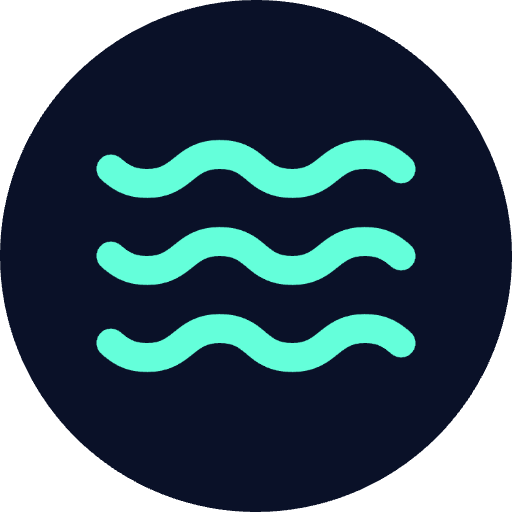

<p align="center">
  
</p>

<h1 align="center">Anchor: Anxiety Navigator</h1>

<p align="center">Therapeutic mobile app for immediate relief during anxiety and panic attacks. Evidence-based CBT and somatic grounding delivered through a calming deep-ocean interface.</p>

<p align="center">
  <a href="https://apps.apple.com/de/app/id6756347720"></a>
  <a href="https://play.google.com/store/apps/details?id=cx.franz.anxietybuddy"></a>
  <a href="https://github.com/mulkatz/anxiety-buddy/releases"></a>
  <a href="LICENSE"></a>
</p>

## What It Does

Anchor is a mental health companion designed for Gen Z experiencing anxiety and panic attacks. Unlike wellness apps with gamification, this is a **therapeutic interface** — every animation, haptic, and interaction is designed to ground and de-escalate panic.

```
You:    "I can't breathe, everything is too much"
Anchor: "I hear you. Let's slow down together. Can you feel your feet on the ground right now?"
```

The AI uses CBT and ACT techniques in natural conversation. Crisis keywords trigger immediate access to professional resources.

## Features

| Feature                 | Description                                                                                           |
| ----------------------- | ----------------------------------------------------------------------------------------------------- |
| **AI Chat**             | Therapeutic conversations powered by Gemini 2.5 Flash with CBT/ACT techniques                         |
| **Voice Messages**      | WhatsApp-style voice input when typing feels impossible — transcribed via Google Cloud Speech-to-Text |
| **Crisis Detection**    | Real-time keyword monitoring with automatic 988/Crisis Text Line resources                            |
| **The Dive**            | 25-lesson somatic learning program based on Polyvagal Theory                                          |
| **Session Vault**       | AI-generated titles, summaries, and topic tags for conversation history                               |
| **Temporal Awareness**  | Time-aware AI with timezone/DST support and 75-message context                                        |
| **Therapeutic Haptics** | Grounding touch feedback calibrated for anxiety states                                                |
| **i18n**                | English and German                                                                                    |

## Design

**Aesthetic: "Bioluminescence in the Deep"** — the app mimics the deep ocean at night. Calming darkness punctuated by gentle glowing life forms.

- `void-blue` (#0A1128) background, `biolum-cyan` (#64FFDA) accents, `warm-ember` (#FFB38A) warmth
- Viscous animations (600ms+), never snappy
- Glass morphism with therapeutic blur effects
- Minimal text — large, readable sizes for panic states

## Tech Stack

| Layer     | Technology                                                                                                            |
| --------- | --------------------------------------------------------------------------------------------------------------------- |
| Mobile    | [React 18](https://react.dev) + [TypeScript](https://www.typescriptlang.org) + [Capacitor 7](https://capacitorjs.com) |
| Styling   | [Tailwind CSS](https://tailwindcss.com) + Custom therapeutic design tokens                                            |
| Animation | [Framer Motion](https://www.framer.com/motion/)                                                                       |
| AI        | [Vertex AI](https://cloud.google.com/vertex-ai) (Gemini 2.5 Flash)                                                    |
| Speech    | [Google Cloud Speech-to-Text](https://cloud.google.com/speech-to-text) v2                                             |
| Backend   | [Firebase Functions](https://firebase.google.com/docs/functions) (Node.js 22)                                         |
| Database  | [Cloud Firestore](https://firebase.google.com/docs/firestore)                                                         |
| Auth      | [Firebase Auth](https://firebase.google.com/docs/auth) (Anonymous)                                                    |
| Build     | [Vite](https://vitejs.dev)                                                                                            |

## Project Structure

```
anxiety-buddy/
├── app/                         # Mobile app (React + Capacitor)
│   ├── src/
│   │   ├── pages/               # Route-level screens
│   │   ├── components/
│   │   │   ├── ui/              # Atomic, reusable components
│   │   │   └── features/        # Feature-specific (chat, dive, profile)
│   │   ├── hooks/               # Custom React hooks
│   │   ├── contexts/            # Global state (App, UI, Dialog, Dive)
│   │   ├── services/            # Firebase, analytics integrations
│   │   ├── data/                # Static data (dive lessons)
│   │   └── assets/translations/ # i18n JSON files (en, de)
│   └── native/                  # iOS & Android projects
│
├── backend/                     # Firebase Functions
│   └── functions/src/
│       ├── chat.ts              # AI chat (Gemini)
│       ├── transcription.ts     # Speech-to-Text + FFmpeg conversion
│       ├── diveChat.ts          # Dive AI responses
│       ├── conversations.ts     # Conversation lifecycle
│       └── usage/               # Cost tracking system
│
├── web/                         # Landing page
└── docs/                        # Architecture & feature documentation
```

## Getting Started

### Prerequisites

- Node.js 18+ and npm 9+
- Firebase CLI: `npm install -g firebase-tools`
- For iOS: Xcode 14+ (macOS only)
- For Android: Android Studio
- GCP project with Vertex AI and Speech-to-Text APIs enabled

### Install

```bash
npm install              # Root
cd app && npm install    # Frontend
cd ../backend/functions && npm install  # Backend
```

### Environment Setup

```bash
cp app/.env.example app/.env
# Add your Firebase credentials to app/.env
```

### Development

```bash
# Web dev server
cd app && npm run dev

# iOS
cd app && npm run build && npx cap sync && npx cap open ios

# Android
cd app && npm run build && npx cap sync && npx cap open android

# Backend emulator
cd backend && firebase emulators:start
```

## Security & Privacy

- **User-scoped access** — users can only read/write their own data
- **7-day audio retention** — voice recordings auto-delete
- **Encryption** — TLS 1.3 in transit, AES-256 at rest
- **Minimal data collection** — no PHI, no data sales
- **Export & delete** — full data export and account deletion anytime

## Crisis Resources

If you or someone you know is in crisis:

- **988 Suicide & Crisis Lifeline:** Call or text 988 (24/7)
- **Crisis Text Line:** Text HOME to 741741
- **International:** [findahelpline.com](https://findahelpline.com)

## Contributing

We welcome contributions! Please see [CONTRIBUTING.md](CONTRIBUTING.md) for guidelines.

This is a mental health application — please be mindful of clinical accuracy, safety-first design, and accessibility for cognitive overload states.

## License

MIT License — see [LICENSE](LICENSE) for details.

---

_Built with care for those navigating anxiety. You matter. You're not alone._
