# Chat System Architecture: Visual Guide

**Version:** 1.0
**Last Updated:** December 2024
**Covers:** Chat flow, Memory system, Extraction, Personalization, Localization

This document provides a comprehensive visual overview of Anchor's chat system architecture, including the two-tier memory system, extraction pipeline, and personalization features.

---

## Table of Contents

1. [System Architecture Overview](#1-system-architecture-overview)
2. [Main Chat Message Flow](#2-main-chat-message-flow)
3. [Memory Architecture](#3-memory-architecture)
4. [Extraction Pipeline](#4-extraction-pipeline)
5. [Topic Lifecycle](#5-topic-lifecycle)
6. [Context Assembly](#6-context-assembly)
7. [System Prompt Construction](#7-system-prompt-construction)
8. [Validation Pipeline](#8-validation-pipeline)
9. [Localization Flow](#9-localization-flow)
10. [Personalization Features](#10-personalization-features)
11. [Crisis Detection](#11-crisis-detection)
12. [Temporal Awareness](#12-temporal-awareness)
13. [Data Flow Summary](#13-data-flow-summary)

---

## 1. System Architecture Overview

High-level view of all components and their interactions.

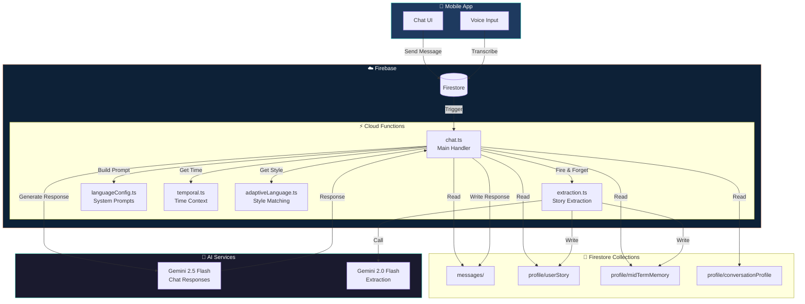

---

## 2. Main Chat Message Flow

Detailed sequence of what happens when a user sends a message.

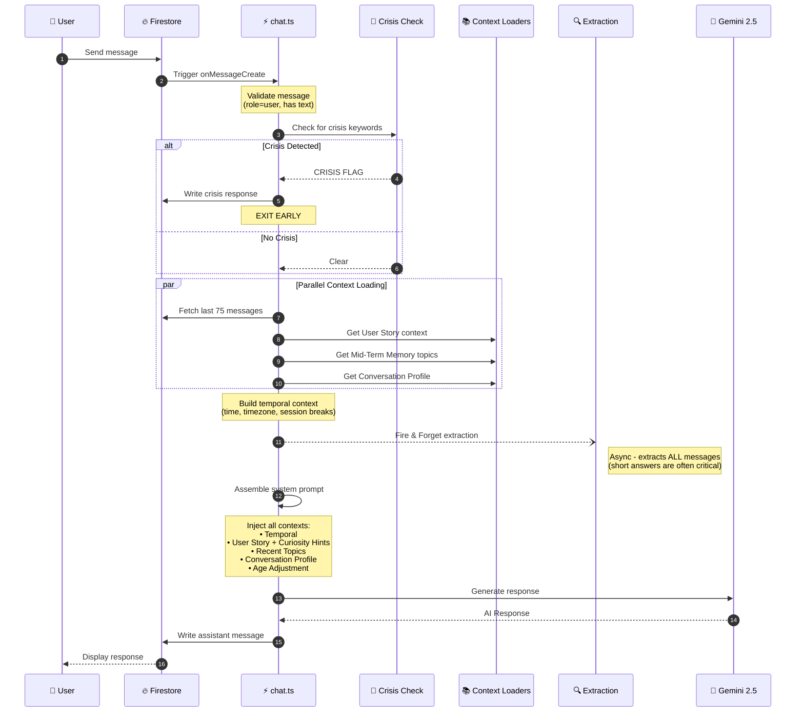

---

## 3. Memory Architecture

The two-tier memory system and what each tier stores.

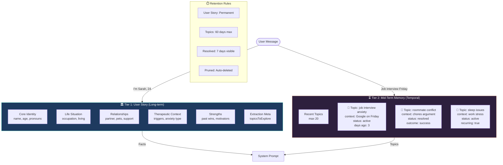

### Memory Comparison

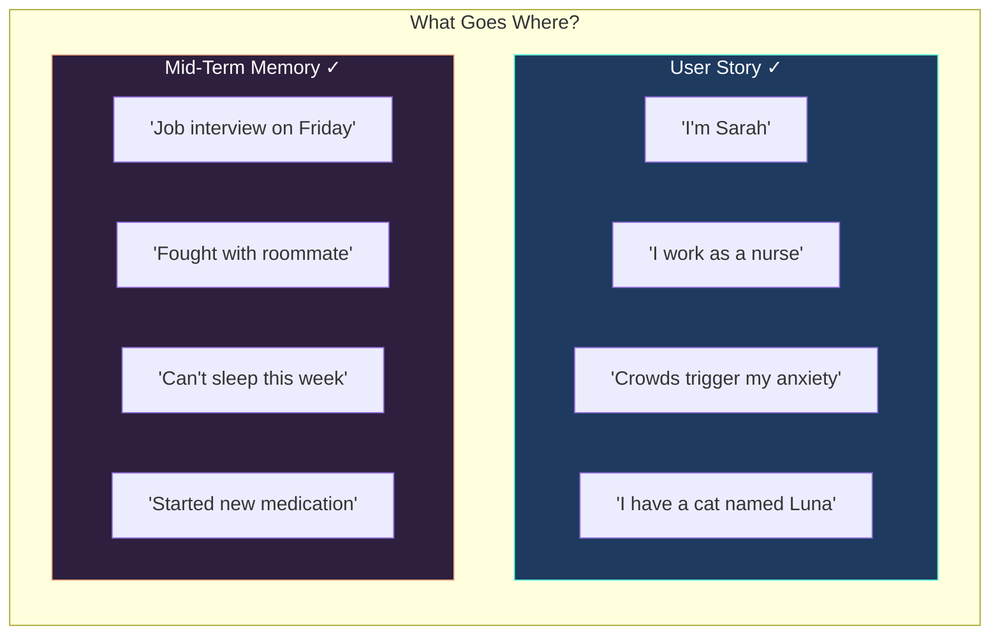

---

## 4. Extraction Pipeline

How information is extracted from user messages and stored.

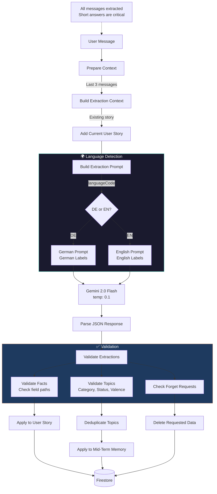

### Extraction Output Structure

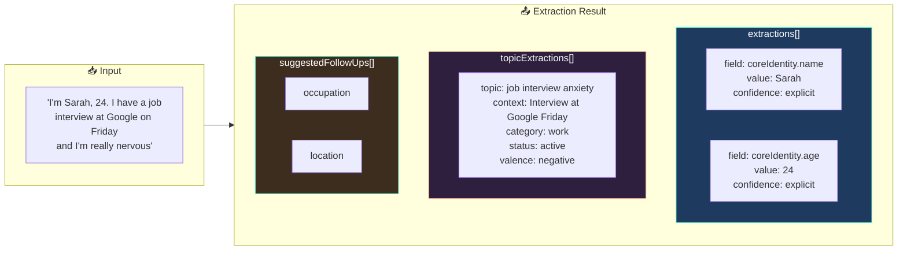

---

## 5. Topic Lifecycle

State machine showing how topics evolve over time.

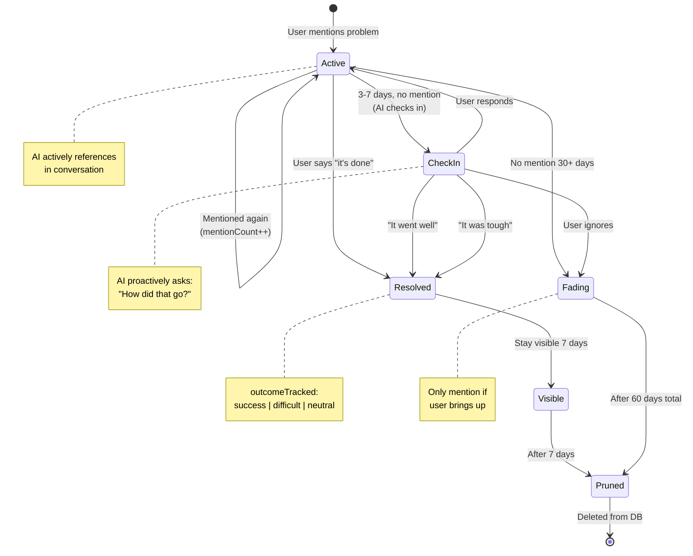

### Topic Priority Matrix

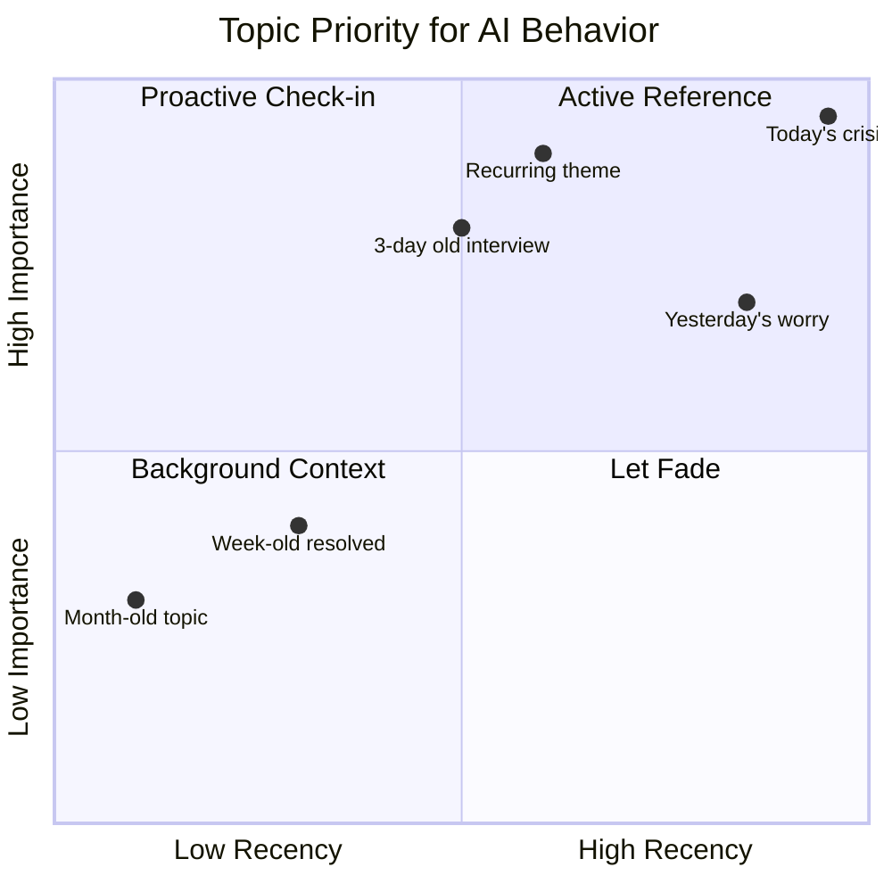

---

## 6. Context Assembly

How different contexts are loaded and combined.

```mermaid
flowchart TB
    subgraph Parallel["⚡ Parallel Loading"]
        direction LR
        Load1[getLocalizedStoryContext]
        Load2[getLocalizedRecentTopicsContext]
        Load3[getConversationProfile]
        Load4[Fetch 75 messages]
    end

    subgraph StoryContext["📋 User Story Context"]
        direction TB
        SC1["Name: Sarah"]
        SC2["Age: 24"]
        SC3["Work: nurse"]
        SC4["Triggers: crowds"]
        SC5["Past wins: handled interview"]
        SC6["---"]
        SC7["Curiosity hints:<br/>what drives them, their background"]
    end

    subgraph TopicsContext["⏳ Topics Context"]
        direction TB
        TC1["[today] sleep issues: work stress"]
        TC2["[3 days ago] interview anxiety → check in"]
        TC3["[yesterday] roommate: resolved (went well!)"]
    end

    subgraph ProfileContext["🎭 Conversation Profile"]
        direction TB
        PC1["Texting style: casual"]
        PC2["Emoji usage: moderate"]
        PC3["Message length: short"]
    end

    subgraph TemporalContext["🕐 Temporal Context"]
        direction TB
        TC4["Monday, Dec 23, 10:32 PM (late night)"]
        TC5["Session break: returning after 6 hours"]
    end

    Load1 --> StoryContext
    Load2 --> TopicsContext
    Load3 --> ProfileContext
    Load4 --> TemporalContext

    StoryContext --> Assembly[Context Assembly]
    TopicsContext --> Assembly
    ProfileContext --> Assembly
    TemporalContext --> Assembly

    Assembly --> SystemPrompt[Complete System Prompt]

    style Parallel fill:#1a1a2e,stroke:#64FFDA,color:#fff
    style Assembly fill:#1e3a5f,stroke:#FFB38A,color:#fff
```

---

## 7. System Prompt Construction

How the final system prompt is assembled with all components.

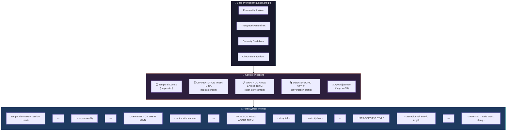

### Prompt Injection Points

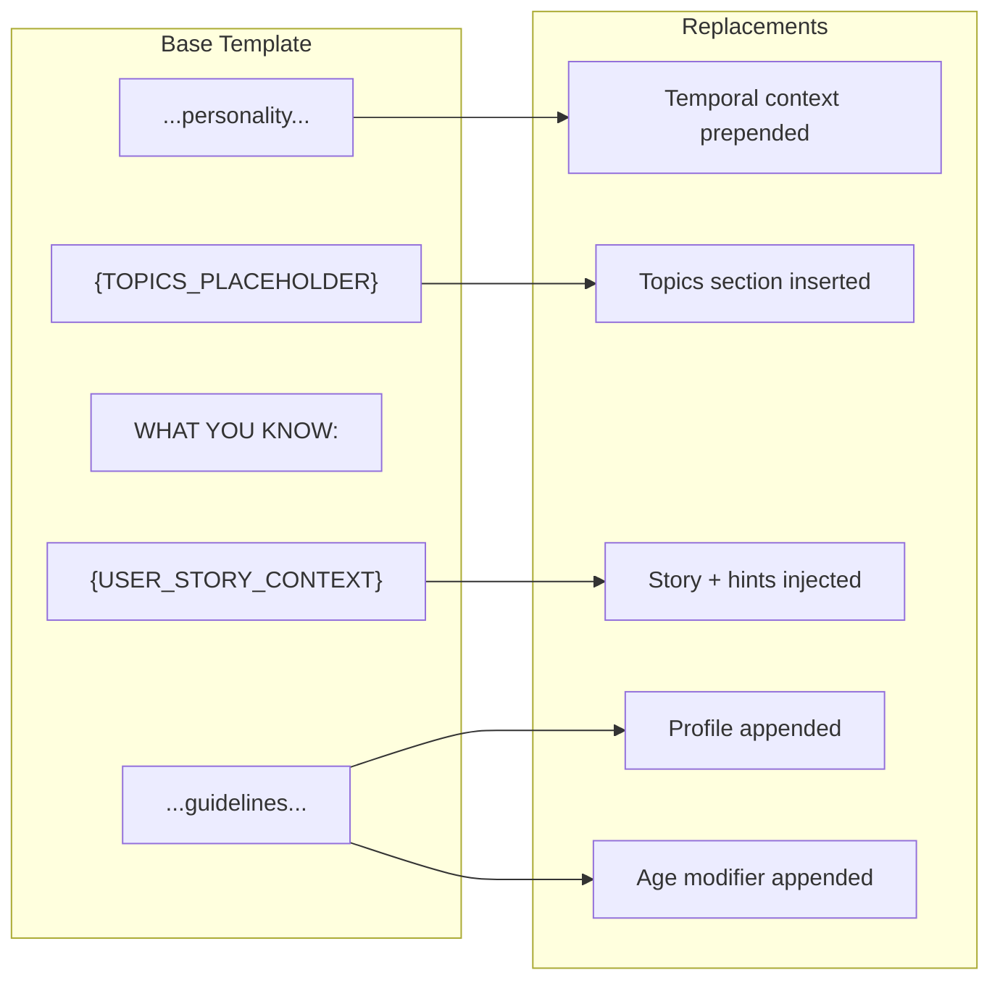

---

## 8. Validation Pipeline

Data quality checks before storage.

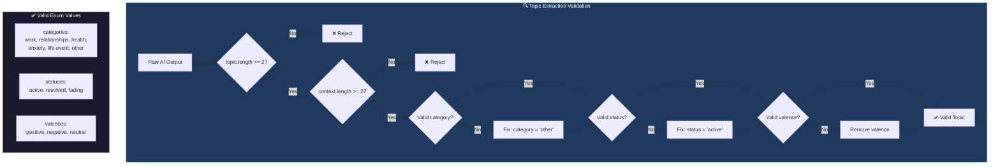

### Deduplication Logic

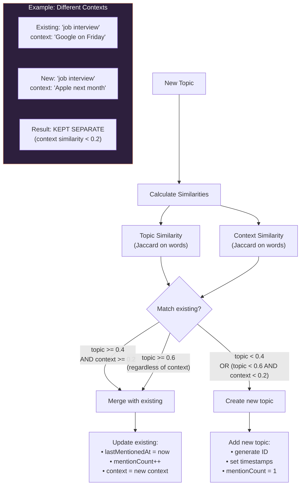

---

## 9. Localization Flow

How language affects the entire system.

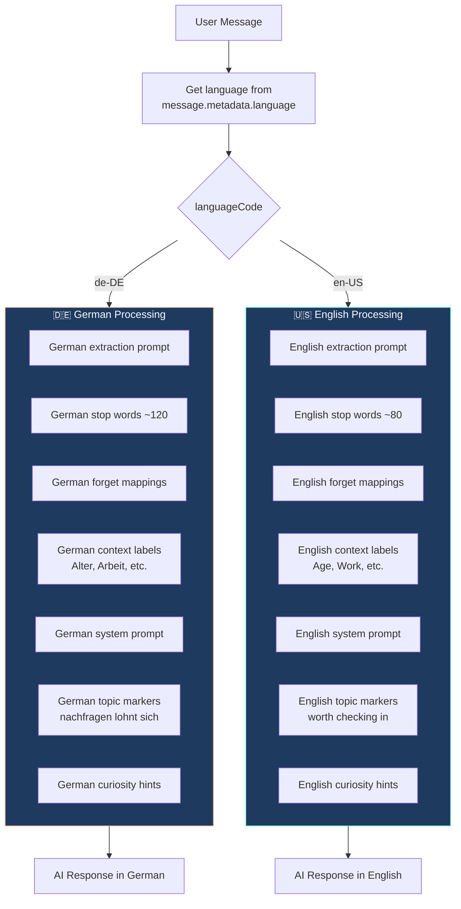

### Localized Components Table

```mermaid
flowchart LR
    subgraph Components["Localized Components"]
        direction TB
        C1["Extraction Prompts"]
        C2["Stop Words"]
        C3["Forget Request Mappings"]
        C4["Context Labels"]
        C5["System Prompts"]
        C6["Topic Markers"]
        C7["Curiosity Hints"]
        C8["Crisis Messages"]
        C9["Time Labels (heute/today)"]
    end

    subgraph EN["English"]
        E1["Extract information..."]
        E2["the, a, an, I..."]
        E3["forget my name"]
        E4["Age:, Work:"]
        E5["you're anchor..."]
        E6["→ worth checking in"]
        E7["what they do for work"]
        E8["988 Suicide Lifeline"]
        E9["yesterday, 3 days ago"]
    end

    subgraph DE["German"]
        D1["Extrahiere Informationen..."]
        D2["der, die, das, ich..."]
        D3["vergiss meinen namen"]
        D4["Alter:, Arbeit:"]
        D5["du bist anchor..."]
        D6["→ nachfragen lohnt sich"]
        D7["was sie arbeiten"]
        D8["Telefonseelsorge"]
        D9["gestern, vor 3 Tagen"]
    end

    Components --> EN
    Components --> DE
```

---

## 10. Personalization Features

### Age-Appropriate Tone

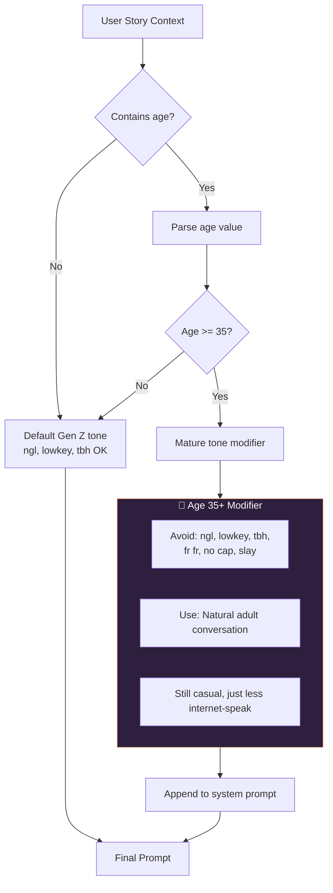

### Curiosity Hints System

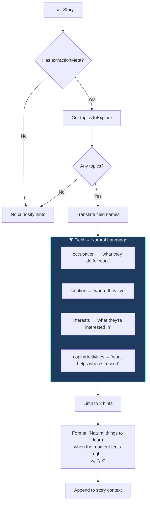

### Adaptive Language Style

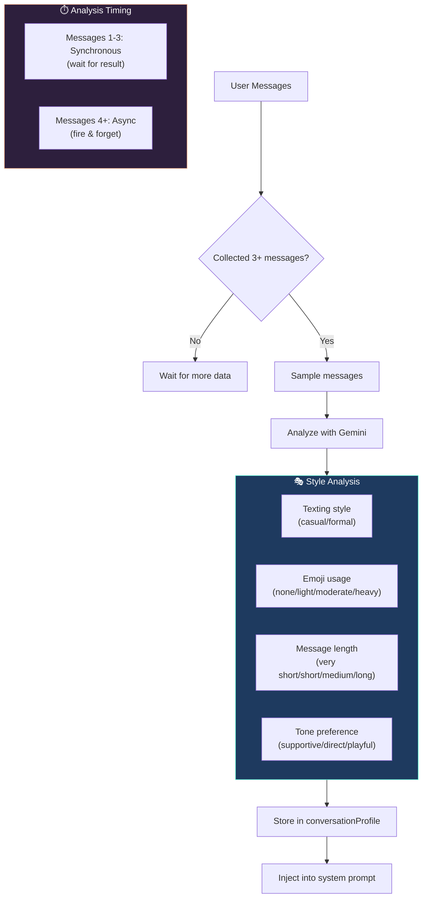

---

## 11. Crisis Detection

Safety-first architecture with immediate response.

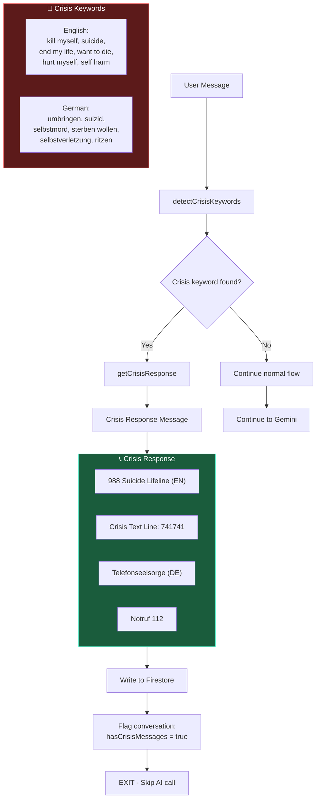

---

## 12. Temporal Awareness

How time context is built and used.

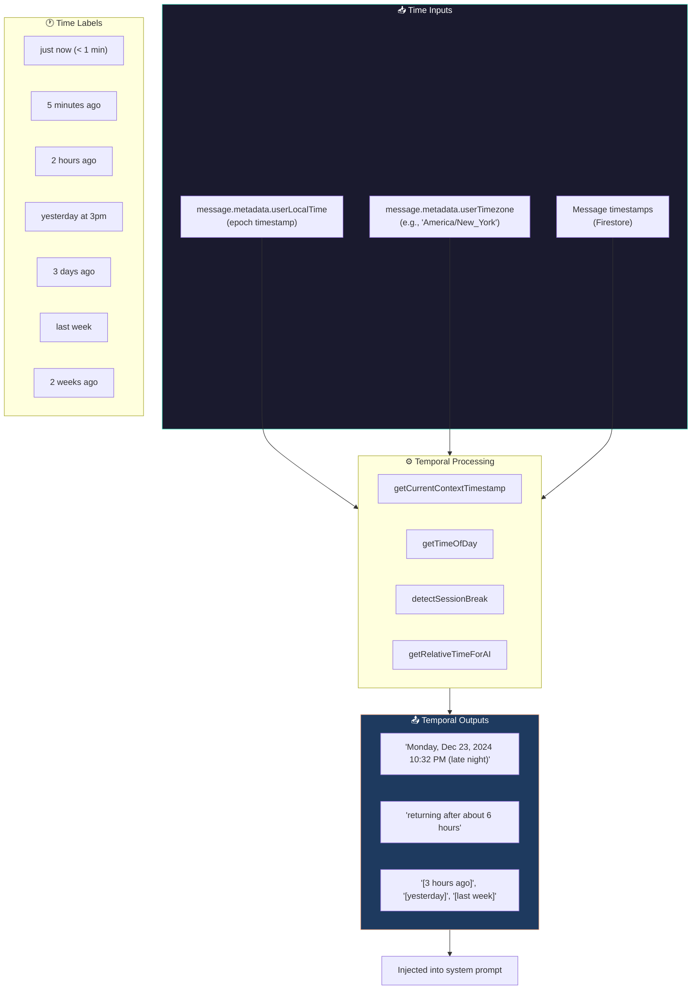

### Session Break Detection

```mermaid
flowchart LR
    LastMsg[Last Message Time] --> Diff{Time difference?}

    Diff -->|"< 4 hours"| NoBreak[No session break]
    Diff -->|"4-12 hours"| ShortBreak["'a few hours'"]
    Diff -->|"12-24 hours"| DayBreak["'since yesterday'"]
    Diff -->|"1-7 days"| WeekBreak["'a few days'"]
    Diff -->|"> 7 days"| LongBreak["'over a week'"]

    ShortBreak --> Inject["Inject into prompt:<br/>'User is returning after X'"]
    DayBreak --> Inject
    WeekBreak --> Inject
    LongBreak --> Inject
```

---

## 13. Data Flow Summary

Complete end-to-end data flow visualization.

```mermaid
flowchart TB
    subgraph UserAction["👤 User Action"]
        Send[Send Message]
    end

    subgraph Trigger["⚡ Firebase Trigger"]
        OnWrite[onDocumentWritten]
    end

    subgraph Validation["✅ Validation"]
        V1{Is user message?}
        V2{Has text?}
        V3{Crisis check}
    end

    subgraph DataLoading["📚 Parallel Data Loading"]
        L1[75 messages history]
        L2[User Story]
        L3[Mid-Term Topics]
        L4[Conversation Profile]
    end

    subgraph ContextBuilding["🔧 Context Building"]
        C1[Temporal context]
        C2[Topic context with markers]
        C3[Story context with hints]
        C4[Age adjustment]
        C5[Style profile]
    end

    subgraph PromptAssembly["📝 Prompt Assembly"]
        P1[Base personality]
        P2[+ Temporal]
        P3[+ Topics]
        P4[+ Story]
        P5[+ Style]
        P6[+ Age modifier]
    end

    subgraph AIGeneration["🤖 AI Generation"]
        Gemini[Gemini 2.5 Flash]
    end

    subgraph AsyncExtraction["🔍 Async Extraction"]
        E1[Parse message]
        E2[Extract facts → User Story]
        E3[Extract topics → Mid-Term]
        E4[Validate & dedupe]
    end

    subgraph Response["💬 Response"]
        Write[Write to Firestore]
        Display[Display to user]
    end

    UserAction --> Trigger
    Trigger --> Validation
    Validation --> DataLoading
    DataLoading --> ContextBuilding
    ContextBuilding --> PromptAssembly
    PromptAssembly --> AIGeneration
    AIGeneration --> Response

    Trigger -.->|"Fire & Forget<br/>(ALL messages)"| AsyncExtraction
    AsyncExtraction -.-> L2
    AsyncExtraction -.-> L3

    style UserAction fill:#1a1a2e,stroke:#64FFDA,color:#fff
    style DataLoading fill:#1e3a5f,stroke:#64FFDA,color:#fff
    style ContextBuilding fill:#2d1f3d,stroke:#FFB38A,color:#fff
    style PromptAssembly fill:#1e3a5f,stroke:#FFB38A,color:#fff
    style AIGeneration fill:#1a1a2e,stroke:#64FFDA,color:#fff
    style AsyncExtraction fill:#3d1f1f,stroke:#ff9999,color:#fff
```

---

## Component Dependencies

```mermaid
graph LR
    subgraph Core["Core Files"]
        Chat[chat.ts]
        Lang[languageConfig.ts]
    end

    subgraph UserStory["User Story Module"]
        Extract[extraction.ts]
        Context[context.ts]
        Prompts[prompts.ts]
        Types[types.ts]
    end

    subgraph Support["Support Modules"]
        Temporal[temporal.ts]
        Adaptive[adaptiveLanguage.ts]
    end

    Chat --> Lang
    Chat --> Extract
    Chat --> Context
    Chat --> Temporal
    Chat --> Adaptive

    Extract --> Prompts
    Extract --> Types
    Context --> Types

    Lang --> Context

    style Core fill:#1e3a5f,stroke:#64FFDA,color:#fff
    style UserStory fill:#2d1f3d,stroke:#FFB38A,color:#fff
    style Support fill:#1a1a2e,stroke:#64FFDA,color:#fff
```

---

## Quick Reference: What Triggers What

| User Action     | Immediate Effect      | Async Effect              |
| --------------- | --------------------- | ------------------------- |
| Send message    | AI response generated | Facts/topics extracted    |
| Mention name    | -                     | Stored in User Story      |
| Mention problem | -                     | Stored in Mid-Term Memory |
| Say "forget X"  | Acknowledged          | Data deleted              |
| Return after 6h | Session break noted   | -                         |
| Use casual tone | -                     | Style profile updated     |

---

## File Reference

| File                  | Purpose                     | Key Functions                                          |
| --------------------- | --------------------------- | ------------------------------------------------------ |
| `chat.ts`             | Main message handler        | `onMessageCreate`                                      |
| `languageConfig.ts`   | Prompts & crisis detection  | `getSystemPrompt`, `detectCrisisKeywords`              |
| `extraction.ts`       | Story & topic extraction    | `extractStoryFromMessage`, `applyTopicExtractions`     |
| `context.ts`          | Format contexts for prompts | `getLocalizedStoryContext`, `getRecentTopicsForPrompt` |
| `prompts.ts`          | Extraction prompt templates | `getExtractionPrompt`                                  |
| `types.ts`            | Type definitions            | `UserStory`, `MidTermMemory`, `RecentTopic`            |
| `temporal.ts`         | Time awareness              | `getRelativeTimeForAI`, `detectSessionBreak`           |
| `adaptiveLanguage.ts` | Style matching              | `analyzeUserStyle`, `getConversationProfile`           |

---

_This document provides a visual reference for understanding the chat system's architecture. For implementation details, see the source files and `user-story.md`._
